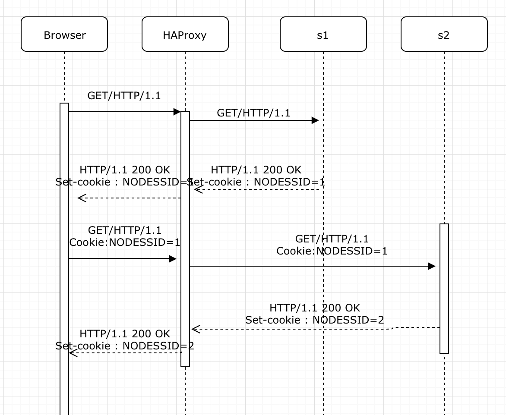

# Administration IT
## Laboratoire n°3 : 

> Auteurs : Loic Frueh - Koubaa Walid	
> Date : 15.12.2018  

### Objectives

Pedagogical objectives
Deploy a web application in a two-tier architecture for scalability

Configure a load balancer

Performance-test a load-balanced web application

In this lab you will perform a number of tasks and document your progress in a lab report. Each task specifies one or more deliverables to be produced. Collect all the deliverables in your lab report. Give the lab report a structure that mimics the structure of this document.

##Task 1

First we downloaded vagrant and Jmeter on both are laptops.
Once we cloned the repository, we execute the command:
	
	vagrant up
	
 
	
we obtain the same result as specified.

Some occasional error messages from dpkg-preconfigure, debconf or invoke-rc.d, appeared. We safely ignore them.

Then we log into the ubuntu VM with the command 

	vagrant ssh
	

	
Here is all the docker inside

 

Nous obtenons en lancant sur postant un requete sur l'adresse http://192.168.42.42/  avec POSTMAN.

 

1. When you open and refresh the URL http://192.168.42.42 in your browser. Add screenshots to complement your explanations. We expect that you take a deeper a look at session management.

	Here is the first access

	 
 
	Here is the second access

	 

	Each time we change a session we can see that the sessions changes between s1 and s2. This **round robin** configuration changes server every time.This configuration is specified in the **hapconfig.cfg** file.

2. A correct usage of the load balancer should not be based on a round robin configuration but redirect the request according to servers charge with the appropriate cookie to keep the session.

3. Diagram explaining what happens when we execute a request and then resfreshes the page.

	 

4. Jmeter screenshot

	 

5. Then we execute the command 
		
		docker stop s2

	 
	
	Since the s2 server is no longer available, the round robin will not be changing on each new request. So instead of changing from s1 to s2 it will remain on the unique server available: s1.
	
	Here is an example of diagramm with cookie session with NODESSID:
	
	 

##Task 2

1. We chosed the first way : **use the SERVERID provided by HAProxy.**

	These two objects proposed are both cookies to separate 	requests.
	SERVERID is controlled by HAProxy and NODESESSID is controlled by Node server.
	
	The main difference is the cookie "maker". For the first one,  HAProxy genereates the cookie for each client, whereas for the Node server, node.js creates client's cookie.

2. The only modifications made were to add the following lines to the haproxy.cfg file .

	 

	Let's analyse those new parameters:
	
	- **indirect** : the client having already a cookie will not get a new one
	- **nocache** : the cookie will not be preserved into the cache. This will prevent the same cookie to be redistributed to everyone.

3. Once we have done our modifications in order to add cookies to sessions, we lauch the **reprovision.sh script** to apply these modifications. Here is what we can see now after multiple requests:

	 
	
	We can easily see that the session is preserved (same parameters saved in the session) and that the counter is now increasing, incremented one by one on each refresh.

	 

	Here is a better look to the cookies thanks to chrome devTools.

	 	
	
	 
	
4. Here is a diagram to represent the processus.

	 

	On the first request by the client, he will be redirected to s1 or s2 server depending on distribution policy.
The HAProxy will create a new session for this client and save his id and his session id inside a cookie. If a client refreshes the page, he joins this cookie to the request and HAProxy can then  do a redirection of this request to the same server as before. 

	**Of course this is done for a unique browser. If for exemple we do a request on firefox and do a request then on chrome, since the cookie will not be shared between browsers, a new one will be furnished for the client onto chrome browser.**

5. Here is a comparison before and after of the requests before and after insertion of cookie.

	Before insertion

	 
	
	After insertion
	
	 
	
	Just by analysing these new reports, we can see that the response is slightly faster and therefore the usage/utility of a cookie is there: **a faster throughput**
	
6. Lets analyse now the last Jmeter summary report

	 

	So, in this new exeution, the laod-balancer "balances" requests between the two servers. The main difference with the previous execution is that requests will always reach the same server. If a thread A (on server 1) does all his request before thread B (on server 2), server 1 will receive all the requests and server 2 none. After that, when thread B will be executing, it will be the opposite (none for server 1). We can say that an equilibrium will occur between servers.

##Task 3
	
##Task 4

1. First we need to be sure that the **delay is equal to 0 ms** for the s1 server.

		docker inspect --format '{{ .NetworkSettings.IPAddress }}' s1
		$ curl -H "Content-Type: application/json" -X POST -d '{"delay": 0}' http://172.17.0.2:3000/delay

	 

	Once the delay is configured, the response will take the amount of time configured.

	Here is the result:

	 

2. First we need to be sure that the **delay is equal to 250 ms** for the s1 server.

	 
	
	Here is the Jmeter test for the s1 server.
	
	We can see that requests to s1 server are clearly slower. 	The troughout is slower since the delay is bigger.
	
	 

	It is now pretty slow for s1 server to have a response.
	
	 

3. Now lets set the **delay to 2500 ms** for the s1 server.

	 
	
	Well after many many trials to be redirected to the s1 server, i have always been redirected to the s2 server !
	**The s1 server doesn't appear at all !**
	
	Here is the Jmeter report with only s2 server.
	
	 
	
4.	Well after many many trials to be redirected to the s1 server,with a delay of 2500 ms for the s1 server i have always been redirected to the s2 server !
	####The s1 server doesn't appear at all !
	
	With a delay of 2500 ms, HAProxy appears to ignore the s1 server. The delay is too long so th HAProxy redirects all the request to s2. In fact, the s1 server seems to be down.
	
	 
	
	So as what we can concluded is that the s1 server is down but there is no Jmeter error to declare.
	
5. We need to modify the **haproxy.cfg** file so that the weight changes.

	 
	
	One more time we set a 250 ms delay.
	
	 

	We can now see that requests are redirected onto servers based on their weight. Here, s2 receive a third of all requests and s1 receives two thirds of all requests. As forthe delay, it remains and adds a slight delay for the response.

	In general it seems that this procedure is useful for servers that have a big delay -> the slow server gets a low weight and the speed one gets a bigger weight. 

	 

6. To clean the cookie on each request, we either specify this option on Jmeter or do it manually on each request directly on the browser.

	We already saw the benefits to use a cookie (see up).
Without a cookie, we can see that each request is now considered as a new request and therefore needs a new session. Since s1 has now a delay, for many new sessions requested, s1 will soon be over-demanded by these concurrent thread requests and s2 will take on the new ones to come.

##Task 5

##Conclusion

As a conclusion we can say that this laboratory enabled us to get familiar with some concepts and tools such as load balancing and HAProxy. We can easily recognize the fact that we particularly appreciated discovering this laboratory and discovering proxy such as HAProxy used in so many network infrastructures.

