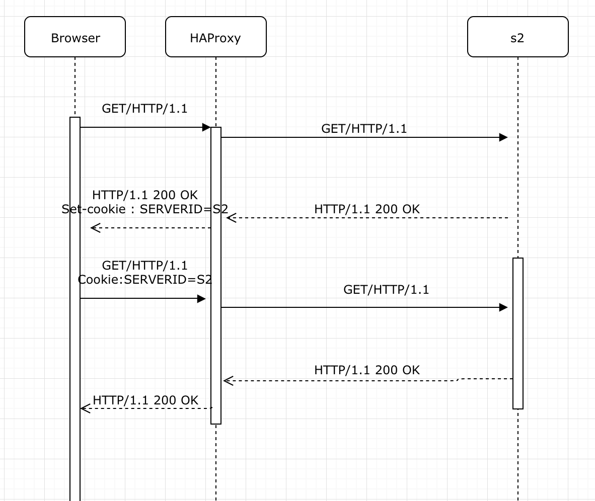
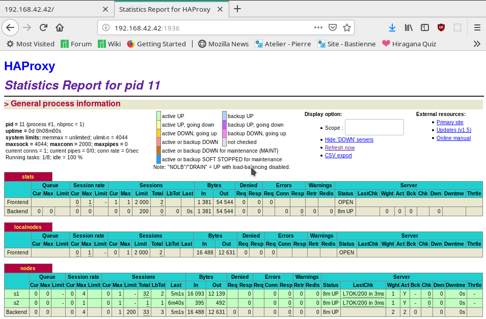
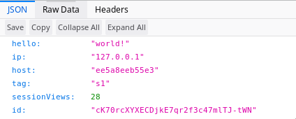
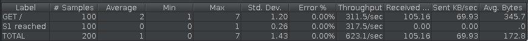

# Administration IT
## Laboratoire n°3 :

> Auteurs : Loic Frueh - Koubaa Walid
> Date : 15.12.2018  

### Objectives

Pedagogical objectives
Deploy a web application in a two-tier architecture for scalability

Configure a load balancer

Performance-test a load-balanced web application

In this lab you will perform a number of tasks and document your progress in a lab report. Each task specifies one or more deliverables to be produced. Collect all the deliverables in your lab report. Give the lab report a structure that mimics the structure of this document.

## Task 1

First we downloaded vagrant and Jmeter on both are laptops.
Once we cloned the repository, we execute the command:

	vagrant up

we obtain the same result as specified.

Some occasional error messages from dpkg-preconfigure, debconf or invoke-rc.d, appeared. We safely ignore them.

Then we log into the ubuntu VM with the command

	vagrant ssh

Here is all the docker inside

Nous obtenons en lancant sur postant un requete sur l'adresse http://192.168.42.42/  avec POSTMAN.

1. When you open and refresh the URL http://192.168.42.42 in your browser. Add screenshots to complement your explanations. We expect that you take a deeper a look at session management.

	Here is the first access

	

	Here is the second access

	

	Each time we change a session we can see that the sessions changes between s1 and s2. This **round robin** configuration changes server every time.This configuration is specified in the **hapconfig.cfg** file.

2. A correct usage of the load balancer should not be based on a round robin configuration but redirect the request according to servers charge with the appropriate cookie to keep the session.

3. Diagram explaining what happens when we execute a request and then resfreshes the page.

	

4. Jmeter screenshot

	

5. Then we execute the command

		docker stop s2

	

	Since the s2 server is no longer available, the round robin will not be changing on each new request. So instead of changing from s1 to s2 it will remain on the unique server available: s1.

	Here is an example of diagramm with cookie session with NODESSID:

	

## Task 2

1. We chosed the first way : **use the SERVERID provided by HAProxy.**

	These two objects proposed are both cookies to separate 	requests.
	SERVERID is controlled by HAProxy and NODESESSID is controlled by Node server.

	The main difference is the cookie "maker". For the first one,  HAProxy genereates the cookie for each client, whereas for the Node server, node.js creates client's cookie.

2. The only modifications made were to add the following lines to the haproxy.cfg file .

    

	Let's analyse those new parameters:

	- **indirect** : the client having already a cookie will not get a new one
	- **nocache** : the cookie will not be preserved into the cache. This will prevent the same cookie to be redistributed to everyone.

3. Once we have done our modifications in order to add cookies to sessions, we lauch the **reprovision.sh script** to apply these modifications. Here is what we can see now after multiple requests:

	

	We can easily see that the session is preserved (same parameters saved in the session) and that the counter is now increasing, incremented one by one on each refresh.

	

	Here is a better look to the cookies thanks to chrome devTools.

	 	

	

4. Here is a diagram to represent the processus.

	

On the first request by the client, he will be redirected to s1 or s2 server depending on distribution policy.
The HAProxy will create a new session for this client and save his id and his session id inside a cookie. If a client refreshes the page, he joins this cookie to the request and HAProxy can then  do a redirection of this request to the same server as before.

**Of course this is done for a unique browser. If for exemple we do a request on firefox and do a request then on chrome, since the cookie will not be shared between browsers, a new one will be furnished for the client onto chrome browser.**

5. Here is a comparison before and after of the requests before and after insertion of cookie.

	Before insertion

	

	After insertion

	

	Just by analysing these new reports, we can see that the response is slightly faster and therefore the usage/utility of a cookie is there: **a faster throughput**

6. Lets analyse now the last Jmeter summary report

	

    So, in this new exeution, the laod-balancer "balances" requests between the two servers. The main difference with the previous execution is that requests will always reach the same server. If a thread A (on server 1) does all his request before thread B (on server 2), server 1 will receive all the requests and server 2 none. After that, when thread B will be executing, it will be the opposite (none for server 1). We can say that an equilibrium will occur between servers.

## Task 3

**Step 4** base screenshot:

### Questions

1. **Here is the screenshots for Step 5:**
	

	This is the command line tool socat which is connecting with the HAProxy.

	

	This is the screenshot of the HAProxy state page

2. **Here is the command for setting the node s1 in DRAIN mode:**

	

	Here is the screenshot of the HAProxy state page after my command above:

	

	We can see, in the nodes section, that the line for the s1 node is now blue instead of green, like in the previous screenshot.
	This indicate us that this node is now in **DRAIN** mode.

3. **I have refresh my browser and this is what i have received:**
    

	We can see that i stay on the **s1** node with one more session view than in the base screenshot of the **step 4**. This is easily understandable.
	The **DRAIN** mode redirect all **NEW** traffic to the other active nodes. However all **CURRENT** sessions with the node in **DRAIN** mode continue to communicate with it.
	So **NEW** traffic => other nodes but **CURRENT** or **IN PLACE** traffic => keep their previous nodes.

	We "freeze" the load of the node with this mode. No new connections are allowed but it keeps the previous one.

4. We are automatically directed on the **s2** node. It's logic because s1 is in **DRAIN** mode and we are trying to make a new connection so we can't reach it.

5. **I have clear my new browser's cookies and refresh multiple time and this is what I receive all the time:**

	

	Once again it's perfectly logic. We can't reach the node in **DRAIN** mode **(s1)** with new traffic.

6. **Now I reset the node **s1** in **READY** mode with this command:**
	

	And that's what I obtain:

    a. ***When I refresh my first browser (the one in step 4)***
    

    We can see that I stay in connection with the **s1** node (the node that was in **DRAIN** mode) but it's normal because this reset don't break previous session connections. So i don't loose my previous connections

	b. ***When I refresh my second browser***
	

	I stay connected with the **s2** node (we can see that with the session view counter which is higher and the id which is the same than before) for the same reason than above. As the connections aren't reset I keep the same session than before (with **s2** in this case).

	c. ***When I clear my second browser's cookies and refresh multiple time***
	

	This time I finally switch to the **s1** node. This is the correct behavior. I'm no more in **DRAIN** mode so s1 is now candidate again for new traffic.

	Finally this is the screenshot of the HAProxy state page:
	

	We can see, in the nodes section, that the line for the **s1** node is now green again (**READY** mode) instead of dark blue (**DRAIN** mode).

7. **Now I set the node s1 in MAINT mode with this command:**
	

	And that's what I obtain:

	a. ***When I refresh my first browser (the one in step 4)***
	

	This is interesting because we notice that I have now a new session with the **s2** node (the one still in **READY** mode). This switching is because the **MAINT** mode redirect **ALL** traffic (current ones and new ones) to the other active nodes. In our case, **s1** is now in **MAINT** mode so it is no more reachable. All traffic will be redirected to **s2** because it is the only active node left.

	b. ***When I refresh my second browser***
	

	As said before, I'm now redirected to the **s2** node because the **s1** node is in **MAINT** mode so unreachable for the moment. Before this I was in connection with the **s1** node and now I switch to the **s2** node with a brand new session.

	c. ***When I clear my second browser's cookies and refresh multiple time***
	

    I m still redirected to the **s2** node (with a new session every time) but still in connection with the **s2** node. As s1 is in **MAINT** mode i can't reach it even with new traffic. When a node is in **MAINT** mode, new and current traffic can't reach it anymore. It is the same as if it was down.

	***Finally this is the screenshot of the HAProxy state page:***
	

	We can see, in the nodes section, that the line for the **s1** node is now brown (**MAINT** mode) instead of green (**DRAIN** mode) like in the previous screenshot.

## Task 4

1. First we need to be sure that the **delay is equal to 0 ms** for the s1 server.

		docker inspect --format '{{ .NetworkSettings.IPAddress }}' s1
		$ curl -H "Content-Type: application/json" -X POST -d '{"delay": 0}' http://172.17.0.2:3000/delay

	

	Once the delay is configured, the response will take the amount of time configured.

	Here is the result:

	

2. First we need to be sure that the **delay is equal to 250 ms** for the s1 server.

	

	Here is the Jmeter test for the s1 server.

	We can see that requests to s1 server are clearly slower. 	The troughout is slower since the delay is bigger.

	

	It is now pretty slow for s1 server to have a response.

	

3. Now lets set the **delay to 2500 ms** for the s1 server.

	

	Well after many many trials to be redirected to the s1 server, i have always been redirected to the s2 server !
	**The s1 server doesn't appear at all !**

	Here is the Jmeter report with only s2 server.

	

4.	Well after many many trials to be redirected to the s1 server,with a delay of 2500 ms for the s1 server i have always been redirected to the s2 server !
	####The s1 server doesn't appear at all !

	With a delay of 2500 ms, HAProxy appears to ignore the s1 server. The delay is too long so th HAProxy redirects all the request to s2.
	In fact, the s1 server seems to be down.

	

	So as what we can concluded is that the s1 server is down but there is no Jmeter error to declare.

5. We need to modify the **haproxy.cfg** file so that the weight changes.

	

	One more time we set a 250 ms delay.

	

	We can now see that requests are redirected onto servers based on their weight.
	Here, s2 receive a third of all requests and s1 receives two thirds of all requests.
	As forthe delay, it remains and adds a slight delay for the response.

	In general it seems that this procedure is useful for servers that have a big delay -> the slow server gets a low weight and the speed one gets a bigger weight.

	

6. To clean the cookie on each request, we either specify this option on Jmeter or do it manually on each request directly on the browser.

	We already saw the benefits to use a cookie (see up).
Without a cookie, we can see that each request is now considered as a new request and therefore needs a new session. Since s1 has now a delay, for many new sessions requested, s1 will soon be over-demanded by these concurrent thread requests and s2 will take on the new ones to come.

## Task 5

### Questions

1. **We have chosen this two strategies:**
	a. ***first***
	b. ***leastconn***

	a. ***First: This strategy works on two great parameter :***
	- the maximum number of connection allowed for a server (maxconn)
	- the number of active servers

    First of all, you **HAVE TO** set a maxconn value otherwise it's an non-sense.  Without a maxconn value this strategy is useless and only the first server (with the lowest id) will receive the connections. When you have set a maxconn value (maybe 20) if the first server reaches 20 connections, the next connection will be made with the second server, and so on once the maximum number of connections (20) in the second server is reached.

	This strategy allow you to modulate the number of active server in function of the traffic. If there is few connections you can power off the servers with the highest ids. In the same way, you can power on more servers at the rush hours. This algorithm allows you to always use the smallest number of servers.

    In order to use this algorithm efficiently, you'd better use a cloud controller to check the server usage and power off the unused ones and turn on new server when the back-end queue is growing.

	So in a nutshell:
	- You need to set a maxconn value (maximum number connection number per server)
	- Once a server reach its maxconn value, the next server is used
	- It allow you to modulate your number of active server according to the traffic intensity

	b. ***Leastconn:***
This strategy is pretty simple, the server with the lowest number of connection receives the next connection. This is the opposite of the previous algorithm. In this case we dispatch the load equally between all servers. If servers have the same number of connections (the lowest number of connection), a round-robin is perform to choose which one will be used for the upcoming connection.

	So in a nutshell:
	- The server with the lowest number of connections is used.
	- If there is other servers with the same number of connection a round-robin choose which one is used.

2. **First, we've set up the "first" strategy:**
	

	Then we played a little bit with **JMeter**:

	a. ***We apply the JMeter given for the round-robin part (1 user, 100 requests):***
		

	We see that all the connections going to the **s1** node (which is the first server, the one with the lowest id).
	This is absolutely normal because we never reach the maxconn value of 20 in this scenario. So it always take the **s1** server.

	b. **We have made a choice. We kept the request number constant (100) and we have played with the number of users:***
		

	We have played like this until we reach a switching point that forced the use of **s2**. We have seen that with 100 requests per user we can have 24 users requesting and still have only one server working **(s1)** like in the screenshot above.

	c. ***But we have made a test with 25 users:***
		

	We see that for 25 users making 100 requests each we forced the use of the second server **(s2)**.
	We can see clearly that the first server is more used than the second one and it's logical with this kind of strategy.

	d. ***In conclusion*** for these test we could say that if we know that there will be less that 25 user making 100 requests we can power off the **s2** server. This is more economic and ecological according to the electric consumption. This kind of choice is the purpose of this strategy => modulate the number of active server according to what number we really need.

	Note: These test are done with unreal values but it is just for playing and put things in perspective.

    **Finally we've set the "leastconn" strategy:**

    ***First with the cookies enabled:***
	

    Then we have made test with **JMeter**:

	a. ***We apply the JMeter given for the round-robin part (1 user, 100 requests):***
		

	We see that only **s1** is reached but it's logic due to the sticky session and the cookies (we only have 1 user so 1 session so 1 server)

	b. ***Then we have changed the number of users (20 users, 100 requests)***
		

	We see that the load is equally dispatch between the two node **(s1 and s2)**.
	However this result is very close of a round-robin with sticky session result. This is certainly due to the fact that the leastconn strategy show the best of its capacities with long very long sessions and we are in **HTTP** so very short sessions.
	Maybe with an other protocol we can test a little bit further than that. Maybe with a test where we could see the repartition in action (live).

	***We have try to see if this proximity with the round-robin result is still true with no sticky session so we have done an other configuration without cookies enabled:***
	

	***And we have made one JMeter test, the same that for the first task (1 user, 100 requests):***
	

	And this result is the same than with the one round-robin algorithm without sticky session.

3. **In conclusion**, we don't think there is an algorithm that is absolutely better than the other between these two. It all depends on the situation. If you have long sessions maybe the leastconn is the best choice for you.
If you have monitored the traffic and you know precisely when it's a rush hour and when it's dead calm or you have automatic tools which could switch on and off your server according to the back-end queue business, maybe you should go to the **"first"** algorithm solution. It will save you energy and money.

    Personally, we both think that the leastconn solution isn't very well suited for this lab as there is only very short sessions. So if we had to choose between these two solutions, we would choose the **"first"** algorithm solution. It fits better with the HTTP protocol than the leastconn.

## Conclusion

As a conclusion we can say that this laboratory enabled us to get familiar with some concepts and tools such as load balancing and HAProxy. We can easily recognize the fact that we particularly appreciated discovering this laboratory and discovering proxy such as HAProxy used in so many network infrastructures.
